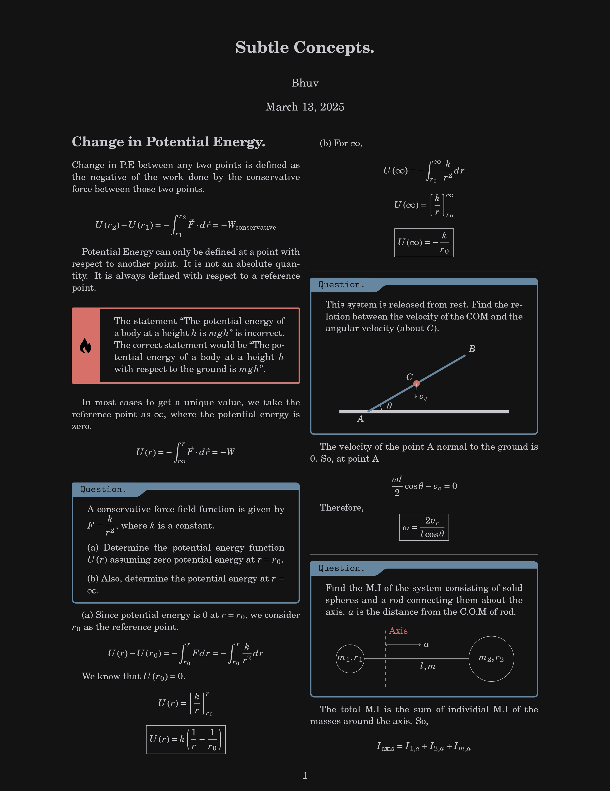

<h1 align="center"> Latex-Notes-Showcase </h1>


--- 
# Contents. 

1. ### [General Information](https://github.com/blxkex/Latex-Notes-Templates?tab=readme-ov-file#general-information)

2. ### [Singularity](https://github.com/blxkex/Latex-Notes-Templates?tab=readme-ov-file#singularity)

3. ### [YoRHa](https://github.com/blxkex/Latex-Notes-Templates?tab=readme-ov-file#yorha-1)

4. ### [My Workfow](https://github.com/blxkex/Latex-Notes-Templates?tab=readme-ov-file#my-workflow)


## General Information.

**This documentation can also serve as a beginner friendly guide to people writing their notes on overleaf and want to switch over to VSCode**. I won't be removing the information (my notes), as some might find the code for the diagrams and etc useful. There might be some minute mistakes here and there.

### Structure. 
```
Singularity/
├── images/
│   ├── image.png
│   ├── imageb.png
├── main.tex
├── preamble.sty
└── {output}.pdf
```

### Modified Margins.

I have modified the margins in both, to accomodate for the double columns. 

```tex
\topmargin=0in        % distance from top of page to header/text
\evensidemargin=0in   % left margin for even-numbered pages
\oddsidemargin=0in    % left margin for odd-numbered pages
\textwidth=6.5in      % width of the text block
\textheight=9.0in     % height of the text block
\headsep=0.25in       % space between header and main text
```

# Singularity. 

<p align="middle">
  
   
</p>


## The boxes.

The boxes are made using the `tcolorbox` package. The heading text can be customized (instead of "Question." it can be "Answer.", etc)

### The blue box. (for question)

```tex
\newtcolorbox{question}[1]{   % [1] means it takes 1 argument
    enhanced, 
    colback=yorhabg,
    colframe=mblue,
    coltext=yorhafg,
    coltitle=yorhabg,
    attach boxed title to top left={yshift*=-\tcboxedtitleheight}, 
    title=\texttt{#1},        % use the argument as the title
    boxed title size=title,
    boxed title style={%
        rounded corners=northeast, 
        rounded corners=northwest, 
        colback=tcbcolframe, 
        boxrule=0pt,
    },
    underlay boxed title={%
        \path[fill=tcbcolframe] (title.south west)--(title.south east) 
            to[out=0, in=180] ([xshift=5mm]title.east)--
            (title.center-|frame.east)
            [rounded corners=5pt] |- 
            (frame.north) -| cycle; 
    },
}
```

#### Usage.

```tex
\begin{question}{Question.}   % same as before
This is a sample question.
\end{question}

\begin{question}{Note.}       % now a different title works too
This is just a note instead of a question.
\end{question}
```

*I have hardcoded the heading as "Question." to reduce repitition, so it is different in my notes.*

---
### The red box. 


Without Heading. (doesn't require any parameters at the beginning of an environment)

```tex
\newtcolorbox{imp}{
    enhanced,               % enable advanced features
    arc=0mm,                % no rounded corners
    colback=yorhabg,        % background color
    colframe=mred,          % frame color
    leftrule=10mm,          % thick left border
    coltext=yorhafg,        % text color
    overlay={               % add custom content on top of the box
        \node[
            anchor=west,    % align image to the left edge
            outer sep=2pt   % small spacing from the frame
        ] at (frame.west) {
            \includegraphics[width=6mm]{images/imageb.png} % icon
        };
    }
}
```

With Heading. 
```tex
\newtcolorbox{shortcut}[1]{   % [1] = takes 1 argument for the title
    enhanced,               % enable advanced features
    arc=0mm,                % no rounded corners
    colback=yorhabg,        % background color
    colframe=mred,          % frame color
    leftrule=10mm,          % thick left border
    coltext=yorhafg,        % text color
    coltitle=yorhabg,       % title background color
    title=\texttt{#1},      % dynamic title (passed as argument)
    overlay={               % add icon on top of the box
        \node[
            anchor=west,    % stick to the left edge
            outer sep=2pt   % spacing from border
        ] at (frame.west) {
            \includegraphics[width=6mm]{images/imageb.png} % icon
        };
    }
}
```

The usage pattern is similar to the blue box. 


# YoRHa.

<p align="middle">
  
   
</p>

Similar Directory structure as [Singularity](https://github.com/blxkex/Latex-Notes-Templates?tab=readme-ov-file#singularity). 


## Background Grid. 

```tex
\AddToShipoutPictureBG{%
\begin{tikzpicture}[remember picture, overlay,
                    help lines/.append style={line width=0.05pt, color=yorhagrid}]
  \draw[help lines] (current page.south west) grid[step=5pt]
                    (current page.north east);
\end{tikzpicture}%
}
```

> Recommended to copy the imported packages from my notes, as I don't clearly remember the packages that were necessary for this.

## The Diagram Frame. 

```tex
\newtcolorbox{boxx}{%
    enhanced,
    colback=yorhabg,
    colframe=yorhafg,
    coltext=yorhafg,
    coltitle=yorhabg,
    arc=0pt,
    outer arc=0pt,
    drop shadow southeast,
    sharp corners
}
```

## The Question Box. (Diagram Frame with Heading)

Made it so that it takes dynamic heading everytime. (similar to the [blue box in Singularity](https://github.com/blxkex/Latex-Notes-Templates?tab=readme-ov-file#the-blue-box-for-question))

```tex
\newtcolorbox{question}[1]{%
    enhanced,
    colback=yorhabg,
    colframe=yorhafg,
    coltext=yorhafg,
    coltitle=yorhabg,
    title=\textbf{#1},
    arc=0pt,
    outer arc=0pt,
    drop shadow southeast,
    sharp corners
}
```

## The bar graph. 

Used python (jupyter notebook) to generate those bars. Basically I give the data as a list of values, it normalizes the values according to the space alotted and returns a string and automatically copies to clipboard using `pyperclip`. **I DID NOT INTEGRATE PYTHON WITH LATEX. I RUN THE NOTEBOOK SEPARATELY.** But, here's the code if you want to run it as a script. 

```py
import pyperclip

# Sample electronegativity values (Pauling scale) for the Boron family
values = [2.0, 1.6, 1.8, 1.8, 1.8]


# ---------------------------------------------------------
# Utility: Compute evenly spaced vertical positions for n items
# ---------------------------------------------------------
def get_label_positions(n: int):
    return [i * (5 / n) for i in range(1, n + 1)]


# ---------------------------------------------------------
# Generate TikZ draw commands for horizontal bars
# Each bar length is scaled relative to the maximum value
# ---------------------------------------------------------
def generate_bar_code(values: list):
    max_val = max(values)
    positions = get_label_positions(len(values))

    code = ""
    for idx, val in enumerate(values):
        scaled_length = round((val / max_val) * 4.5, 4)
        code += (
            fr"\draw[line width=10px] (0, -{positions[idx]}) "
            fr"-- ({scaled_length}, -{positions[idx]}) "
            fr"node[right]{{{val}}};" + "\n"
        )
    return code


# ---------------------------------------------------------
# Generate TikZ node labels for elements
# Currently hard-coded for Boron family: Br, Al, Ga, In, Tl
# ---------------------------------------------------------
def generate_node_labels(family: str):
    if family == "b":
        elements = ["Br", "Al", "Ga", "In", "Tl"]

    positions = get_label_positions(len(elements))
    code = ""
    for idx, element in enumerate(elements):
        code += fr"\node at (-0.5, -{positions[idx]}) {{{element}}};" + "\n"
    return code


# ---------------------------------------------------------
# Generate connecting polyline + markers for data points
# ---------------------------------------------------------
def generate_decorations(values: list):
    max_val = max(values)
    positions = get_label_positions(len(values))

    # Polyline connecting all values
    code = fr"\draw[gruvred] " + " -- ".join(
        [f"({round((val / max_val) * 4.5, 4)}, -{positions[idx]})"
         for idx, val in enumerate(values)]
    ) + ";" + "\n"

    # Draw circles at each point
    for idx, val in enumerate(values):
        x = round((val / max_val) * 4.5, 4) - 0.3
        y = -positions[idx]
        code += fr"\fill[yorhabg] ({x}, {y}) circle (1pt);" + "\n"
        code += fr"\draw[yorhabg] ({x}, {y}) circle (2pt);" + "\n"

    return code


# ---------------------------------------------------------
# Main: Build full TikZ picture code
# ---------------------------------------------------------
result_code = r"""
\node[] at (2, 0) {\underline{Electronegativity}};
\node[draw] at (5, 0) {units = Pauling Scale};
""" + generate_bar_code(values) \
    + generate_node_labels("b") \
    + generate_decorations(values)

# Copy result to clipboard for quick paste into LaTeX
pyperclip.copy(result_code)

```

> I suck at writing readable code. This was rewritten by chatgpt so others could understand it, if you want the raw, unreadable, atrcious code, you can look into the files. 


# My Workflow. 

I use VSCode to write my notes. Because of an extension called `HyperSnips` which makes stuff very much easier for me to write equations by the use of snippets. Like I just type `2/5` in a math environment to get `\frac{2}{5}` and a few others. 

-  `;d` ⇒ `\delta`
- `fm` ⇒ `\({cursor here}\)`

And SO MANY more. I'll explain how to set it up.

## Setup. 

Obviously install VS Code or any VS Code forks (like trae, kiro, etc.)

### 1. Install Latex Distribution.

- If on Linux (arch)
    - `yay -S texlive`

- For Windows: 
    - First install strawberry perl, and then MikTex or any other distribution availble for Windows. 

- For Mac: 
    - Install MacTex. 


### 2. Extensions. 

1. `Latex Workshop` 
2. `HyperSnips`

### 3. Snippets.

Look at this: https://github.com/sleepymalc/VSCode-LaTeX-Inkscape?tab=readme-ov-file#hypersnips

For the setup of the snippets, download [this file](https://github.com/sleepymalc/VSCode-LaTeX-Inkscape/blob/main/VSCode-setting/Snippets/latex.hsnips) and paste it in the respective directory for each OS. The directory location is given in the README of HyperSnips extension. Additional information is provided in sleepymalc's repo too. 

And there you have it! 

---

# Support <3. 

If you found this helpful, feel free to tip—keeps me caffeinated and coding. 